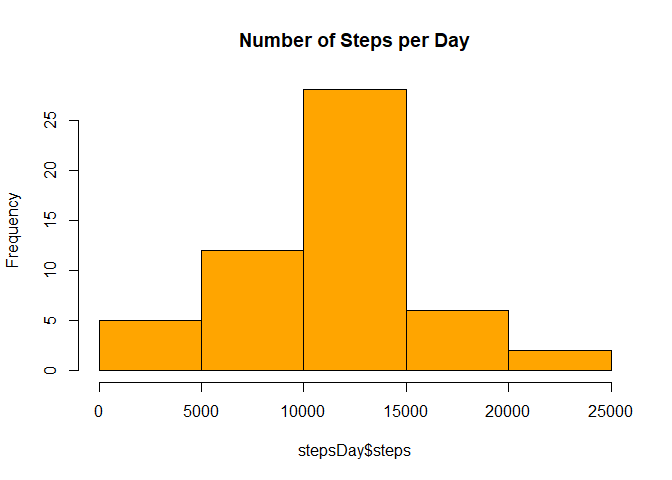
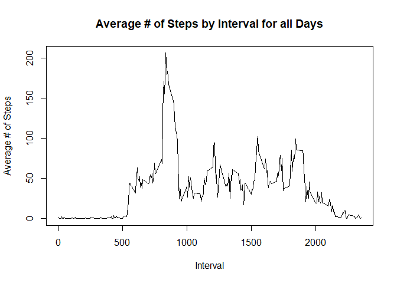
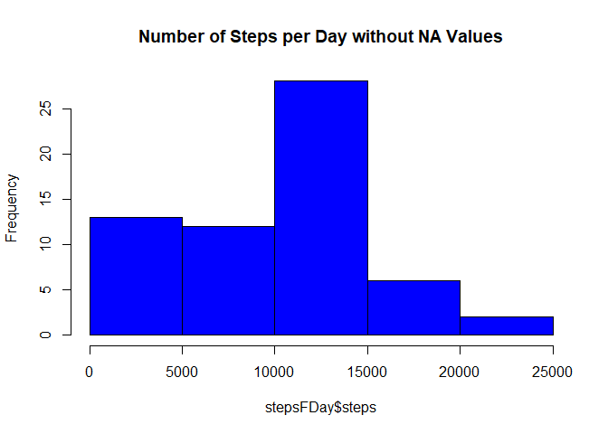
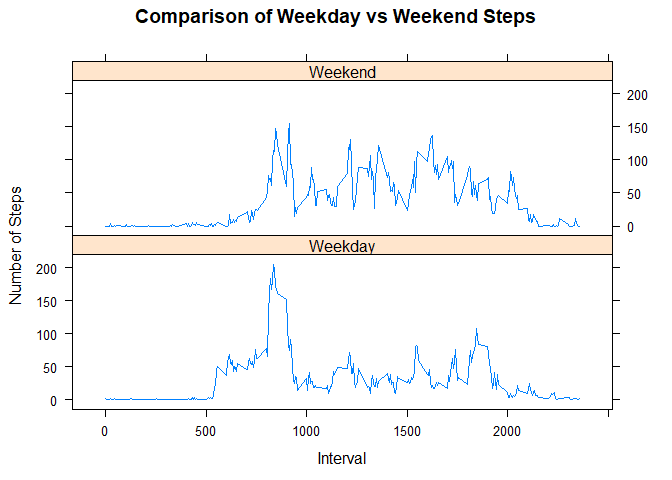

# Reproducible Research Class Project #1
Stephen Whetstone

## Step 1 Code - Read the Data

```r
activity <- read.csv("activity.csv")
```

## Step 2 Code - Histogram of the Total Number of Steps Each Day

```r
stepsDay <- aggregate(steps ~ date, data=activity, FUN=sum)
hist(stepsDay$steps, col="orange", main="Number of Steps per Day")
```

<!-- -->

## Step 3 Code - Mean and Median Number of Steps Each Day

```r
#  summary(stepsDay$steps)  #one method to show mean and median
meanSteps <- round(mean(stepsDay$steps),2)
medianSteps <- median(stepsDay$steps)
```
#### The Mean of daily steps is 10766.19.

#### The Median of daily steps is 10765.

## Step 4 Code - Time Series Plot Avg Number of Steps Taken

```r
stepsInterval <- aggregate(steps ~ interval, data=activity, FUN=mean)
plot(stepsInterval$interval, stepsInterval$steps, type="l",
     xlab = "Interval", ylab="Average # of Steps",
     main="Average # of Steps by Interval for all Days")
```

<!-- -->


## Step 5 Code - ID the 5 Minute Interval that contains Maximum Average # of Steps

```r
maxInterval <- max(stepsInterval$steps)
stepsInterval[which(stepsInterval$steps == maxInterval),]
```

```
##     interval    steps
## 104      835 206.1698
```


## Step 6a Code - Describe and Strategy to fix missing data

```r
missingSteps <- sum(is.na(activity$steps))
```
####  There are 2304 rows of data where the steps are "NA".

## Step 6b Code - Strategy to fix missing data

```r
library(plyr)

activityClean <- activity

impute <- function(x,fun) {
    missing <- is.na(x)
    replace(x, missing, fun(x[!missing]))
}
    
activityFinal <- ddply(activityClean, ~interval, transform,
    steps = impute(steps, median))
```

## Step 7 Code - Histogram after Fixing missing steps

```r
stepsFDay <- aggregate(steps ~ date, data=activityFinal, FUN=sum)

hist(stepsFDay$steps, col="blue", 
     main="Number of Steps per Day without NA Values")
```

<!-- -->

```r
meanFSteps <- round(mean(stepsFDay$steps),2)
medianFSteps <- median(stepsFDay$steps)
```
### I original tried substituting in the Mean, but then the Mean and Medians were both the same.  I tried the Median and got different results and graph.

#### With the NA values replaced, the Mean of daily steps is 9503.87.

#### With the NA values replaced, the Median of daily steps is 10395.

## Step 8 Code - Panel Plot across Weekdays and Weekends

```r
activityFinal$weekday <- weekdays(as.Date(activityFinal$date))
activityFinal$daytype <- ifelse(activityFinal$weekday %in% c('Saturday', 'Sunday'), "Weekend", "Weekday")

weekInterval <- aggregate(steps ~ interval+daytype,
                          data=activityFinal, FUN=mean)

library(lattice)

xyplot(steps~interval|factor(daytype), data=weekInterval,
       type="l", layout=c(1,2), xlab="Interval", 
       ylab="Number of Steps", 
       main="Comparison of Weekday vs Weekend Steps")
```

<!-- -->
